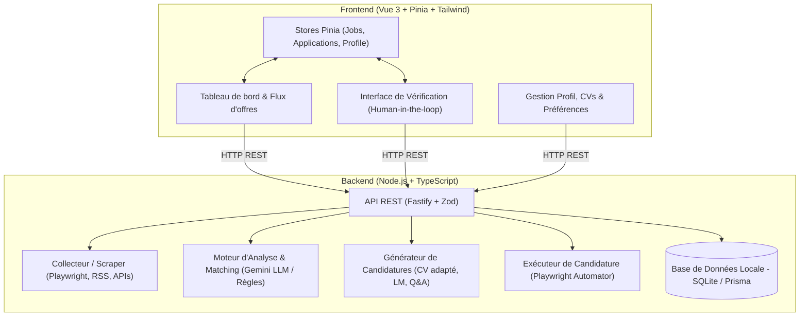
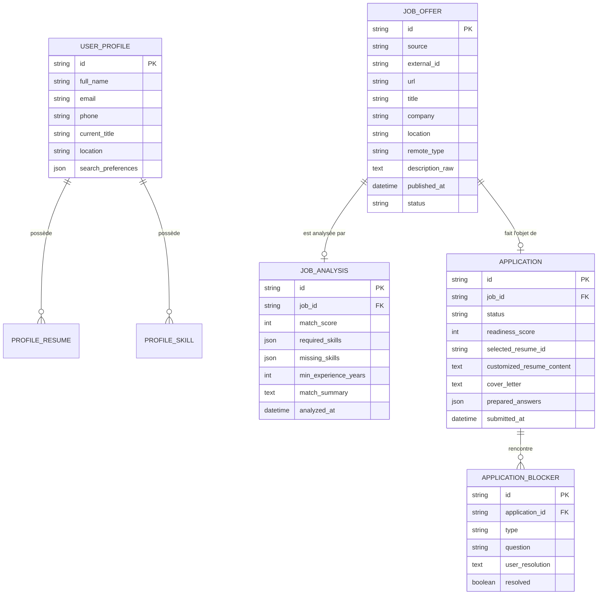
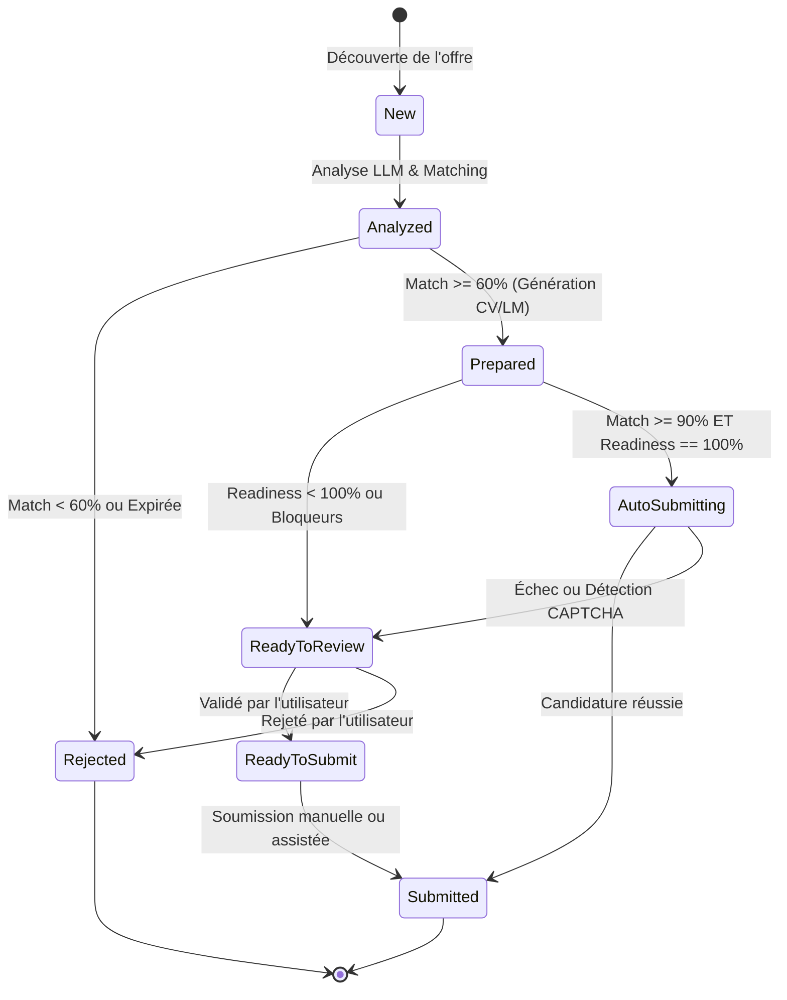

# Jober — Architecture & Spécifications du Contrat API (Frontend / Backend)

Ce document établit le contrat de collaboration technique entre **l'équipe Frontend** (Vue 3 + Pinia + Tailwind CSS) et **l'équipe Backend** (Node.js + TypeScript). Il concrétise les principes fondateurs définis dans le document de cadrage [GEMINI.md](../GEMINI.md).

---

## 1. Vision d'ensemble & Architecture Système

L'application repose sur une séparation nette entre l'interface utilisateur et le moteur d'automatisation.



---

## 2. Clarification Technique : Node.js pour l'IA

- **Orchestration LLM moderne :** Pour appeler les modèles (Google Gemini, OpenAI, Claude ou Ollama localement), tout se fait via des APIs HTTP/REST ou les SDKs officiels Node.js (`@google/genai`, `@google/generative-ai`, SDK OpenAI). Node.js est taillé pour les I/O asynchrones et le streaming de réponses en temps réel.
- **Typage & Structured Outputs avec Zod :** Zod en TypeScript permet de forcer le LLM à retourner des schémas JSON stricts et validés à l'exécution (extraire les compétences, calculer les scores, identifier les points bloquants).
- **Automatisation Web & Playwright :** Playwright a été conçu par Microsoft en premier pour Node.js. L'automatisation des formulaires web et la détection des champs est fluide et performante dans l'écosystème Node.js/TypeScript.
- **Modularité :** Si une tâche nécessitait un traitement Python spécifique (ex: modèle local PyTorch), elle pourra tourner dans un conteneur dédié sans impacter l'architecture.

---

## 3. Modèle Conceptuel de Données

### 3.1. La règle d'or : Match Score vs Application Readiness

Conformément à [GEMINI.md](../GEMINI.md) :
- **`match_score` (0-100%)** : Adéquation entre le profil utilisateur et les exigences du poste.
- **`readiness_score` (0-100%)** : Niveau de préparation et de faisabilité de la candidature.
- **Règle d'automatisation :** Candidature envoyée automatiquement **uniquement si** `match_score >= 90%` ET `readiness_score == 100%` ET `blockers` est vide. Tout score inférieur ou présence d'un point bloquant bascule en statut **Human Review**.

### 3.2. Schéma Relationnel



---

## 4. Cycle de Vie d'une Candidature (Machine à États)



---

## 5. Spécification Détaillée des APIs REST (Contrat d'Interface)

Base URL : `/api/v1`

### 5.1. Profil Utilisateur & Préférences

#### `GET /profile`
Récupère le profil courant, les compétences et les préférences de veille.
* **Réponse (200 OK) :**
```json
{
  "id": "usr_01",
  "fullName": "Jane Doe",
  "email": "jane.doe@example.com",
  "phone": "+33612345678",
  "headline": "Lead Frontend Engineer",
  "location": "Paris, France",
  "skills": ["Vue.js", "TypeScript", "Tailwind CSS", "Node.js", "GraphQL"],
  "searchPreferences": {
    "targetTitles": ["Frontend Lead", "Senior Vue Developer", "Fullstack Node/Vue"],
    "remote": "hybrid_or_full",
    "minSalary": 65000,
    "locations": ["Paris", "Télétravail"]
  },
  "resumes": [
    {
      "id": "res_default",
      "name": "CV_Lead_Frontend_2026.pdf",
      "isPrimary": true,
      "updatedAt": "2026-09-15T10:00:00Z"
    }
  ]
}
```

#### `PUT /profile`
Mise à jour des informations personnelles et préférences de recherche.

---

### 5.2. Gestion des Offres d'Emploi (`/jobs`)

#### `GET /jobs`
Liste filtrée et paginée des offres collectées.
* **Query Parameters :**
  - `status` : `new | analyzed | shortlisted | rejected | archived`
  - `minMatch` : nombre (ex: `70`)
  - `source` : string (ex: `wttj`, `linkedin`)
  - `page` : entier (défaut : `1`)
  - `limit` : entier (défaut : `20`)

* **Réponse (200 OK) :**
```json
{
  "data": [
    {
      "id": "job_101",
      "title": "Senior Vue.js / Node.js Developer",
      "company": "TechSolutions",
      "location": "Paris (Full Remote possible)",
      "remoteType": "full",
      "url": "https://example.com/jobs/101",
      "source": "wttj",
      "publishedAt": "2026-10-05T14:30:00Z",
      "status": "analyzed",
      "analysis": {
        "matchScore": 92,
        "summary": "Excellente adéquation : maîtrise avancée de Vue 3, TypeScript et Node.js demandée.",
        "requiredSkills": ["Vue.js", "TypeScript", "Node.js", "Docker"],
        "matchingSkills": ["Vue.js", "TypeScript", "Node.js"],
        "missingSkills": ["Docker"],
        "minExperienceYears": 5
      },
      "applicationId": "app_501"
    }
  ],
  "total": 45,
  "page": 1,
  "limit": 20
}
```

#### `POST /jobs/collect`
Déclenche la collecte/synchronisation manuelle ou planifiée des offres depuis les sources configurées.
* **Réponse (202 Accepted) :**
```json
{
  "taskId": "task_collect_889",
  "status": "running",
  "message": "Collecte lancée en arrière-plan"
}
```

#### `POST /jobs/:id/analyze`
Force la ré-analyse d'une offre via le moteur LLM.

---

### 5.3. Gestion & Préparation des Candidatures (`/applications`)

#### `GET /applications`
Liste des candidatures en cours (vue Dashboard / Kanban de suivi).
* **Query Parameters :** `status`, `minReadiness`

#### `GET /applications/:id`
Détail complet d'une candidature pour l'écran de revue humaine.
* **Réponse (200 OK) :**
```json
{
  "id": "app_501",
  "jobId": "job_101",
  "status": "ready_for_review",
  "matchScore": 92,
  "readinessScore": 85,
  "preparedData": {
    "selectedResume": {
      "id": "res_default",
      "name": "CV_Lead_Frontend_2026.pdf"
    },
    "customizedHighlights": [
      "Mise en avant de l'expérience de 4 ans sur Vue 3 Composition API",
      "Ajout de projets d'automatisation et Node.js"
    ],
    "coverLetter": "Madame, Monsieur,\n\nAyant développé une solide expertise en architecture Vue 3 et Node.js...",
    "preparedAnswers": [
      {
        "question": "Années d'expérience en Vue.js ?",
        "suggestedAnswer": "6 ans",
        "confidence": 1.0,
        "isConfirmed": true
      },
      {
        "question": "Disponibilité / Préavis ?",
        "suggestedAnswer": "Immédiate ou 1 mois négociable",
        "confidence": 0.9,
        "isConfirmed": false
      }
    ]
  },
  "blockers": [
    {
      "id": "blk_01",
      "type": "subjective_question",
      "question": "Pourquoi souhaitez-vous rejoindre TechSolutions en particulier ?",
      "resolved": false,
      "userResponse": null
    }
  ]
}
```

#### `POST /applications/:id/prepare`
Génère ou régénère la lettre de motivation, le CV adapté et les réponses préremplies via l'IA.

#### `PATCH /applications/:id`
Permet à l'utilisateur de modifier la lettre de motivation, valider les réponses et lever les bloquants.

#### `POST /applications/:id/submit`
Déclenche la soumission de la candidature (mode automatisé ou assistance guidée).

---

## 6. Structure du Répertoire `jober`

```
jober/
├── GEMINI.md               # Document d'intentions et de cadrage
├── docs/
│   └── ARCHITECTURE.md     # Ce document de référence
├── frontend/               # Vue 3, Vite, Pinia, Tailwind CSS
└── backend/                # Node.js, TypeScript, Fastify, Zod, SQLite
```

